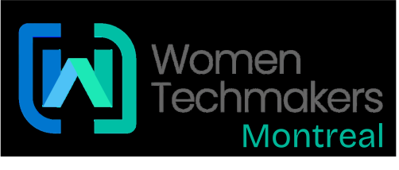

<div align="center">
  
  <h1>WTM Montreal 2026</h1>
  <p><strong>Event Landing Page</strong></p>
</div>

A high-performance, localized event landing page built for Women Techmakers Montreal. This project follows a modular, feature-based architecture and is optimized for speed and accessibility.

## 🚀 Tech Stack

- **Framework:** [Next.js 16 (App Router)](https://nextjs.org/)
- **Language:** [TypeScript](https://www.typescriptlang.org/)
- **Styling:** [Tailwind CSS v4](https://tailwindcss.com/)
- **Animations:** [Framer Motion](https://www.framer.com/motion/)
- **Internationalization:** [next-intl](https://next-intl-docs.vercel.app/)
- **Icons:** [Lucide React](https://lucide.dev/)

## 🛠️ Quick Start

### Prerequisites
- Node.js 18+ 
- npm or pnpm

### Installation
```bash
npm install
```

### Development Server
```bash
npm run dev
# Opens http://localhost:3000
```

### Production Build (Static Export)
```bash
npm run build
# Outputs to /out directory ready for static hosting
```

## 📂 Project Structure

```
src/
├── app/                 # Next.js App Router pages
│   ├── [locale]/        # Localized routes (en/fr)
│   └── global-error.tsx # Error boundary
├── components/
│   ├── layout/          # Structural components (Navbar, Footer)
│   ├── sections/        # Page sections (Hero, Sponsors, etc.)
│   └── ui/              # Reusable UI atoms (Button, FloatingOrb)
├── i18n/                # Localization configuration
├── messages/            # JSON Translation files (The Content Source)
│   ├── en/
│   └── fr/
└── types/               # TypeScript definitions
```

## 🌍 Localization & Content

Content is managed entirely via JSON files in `src/messages/`.

- **To update text:** Edit `src/messages/en/*.json` and `src/messages/fr/*.json`.
- **To add a Sponsor:** Edit `sponsors.json`. The UI updates automatically.
- **To add a Menu Item:** Edit `common.json` under `menu`.

**Important:** If you add new data keys, ensure `src/types/` interfaces are updated to match, or TypeScript will warn you.

## 🖼️ Assets

- **Images:** Place high-res images in `public/images/`.
- **Logos:** Place SVG logos in `public/logo/`.
- **Favicons:** Handled automatically by Next.js via `src/app/icon.png`.

## 🚢 Deployment

This project is configured for **Static Export** (`output: 'export'`).

### GitHub Pages (Automated)
1. Push to `main` branch.
2. The GitHub Action (if configured) will build and deploy the `out/` folder.

### Manual / Surge.sh
```bash
npm run build
npx surge out
```

## 🛠️ Maintainers

- **WTM Montreal Team** - [info@wtmmontreal.com](mailto:info@wtmmontreal.com)

## 🤝 Contributing

1. Fork the repo.
2. Create a feature branch.
3. Commit changes.
4. Open a Pull Request.

---
© 2026 Women Techmakers Montreal | Licensed under MIT
